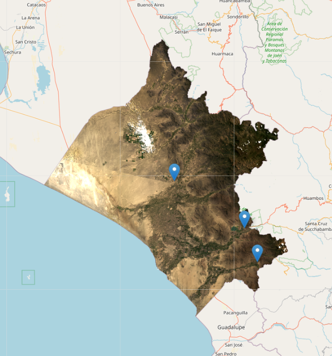

   

<h4 align="center"> Aplicación de Hidrología usando Python :ear_of_rice: </h4>

   

## Descripción 
Desarrollo de un trabajo de investigación sobre estimaciones de evapotranspiración en cultivos de arroz usando el modelo METRIC basado la ecuación de balance de energia. 
Aplicacion con imágenes satelitales Landsat 8.

Curso gratis sobre evapotranspiración en: [HydroLearn - Evapotrasnpiration](https://edx.hydrolearn.org/courses/course-v1:HumboldtState+ENGR440+2020_Fall/about)

## Visualización
Dos opciones:
- Ver libreta online: 
- Ejecutar la libreta en Google Colab: 

## Licencia/License
MIT License - Copyright (c) 2021 Cesar Francisco Vilca Gamarra \
Mayor información [aquí](https://github.com/vilcagamarracf/Inv_arroz_METRIC/blob/main/LICENSE)

## Contacto
En estas redes sociales comparto una variedad de contenidos sobre Agricultura de Precisión, programación con Earth Engine y más.

> &nbsp;&middot;&nbsp; Website [vilcagamarracf.github.io](https://vilcagamarracf.github.io/) &nbsp;&middot;&nbsp;
> LinkedIn [@cesarvilca](https://www.linkedin.com/in/cesarvilca/) &nbsp;&middot;&nbsp;
> Twitter [@vilcagamarracf](https://twitter.com/vilcagamarracf)
